# AOO data scraper

This is a data collection tool for the game AOO.

The whole process is divided in two parts:
1. A bot collects raw data from nation rankings, city info frame from all players in selected alliances, and strongest commander event results.
2. Raw data is processed to first, group them by city and second, insert them in a database while matching cities in the collected data with cities in the database.

The code is written in Python and necessitates an Android emulator to run the bot, only BlueStack on Windows has been tested.
You should have a descent computer with a good CPU, a good amount of RAM and a GPU (the OCR module is based on deep learning) to run the bot efficiently.

DISCLAIMER: This project is really messy and not user-friendly, it was made for personal use and is shared here as is. 
It started as a proof of concept and was never really refactored.
It however has been used to collect data in world 385 during 2 years and has become reliable yet not bug-free (or user-friendly).

This tool may not be suited for young worlds as it assumes that city stats vary slowly over time. 

## License

This work is licensed under [Creative Commons BY-NC-SA 4.0](https://creativecommons.org/licenses/by-nc-sa/4.0/)

You are free to use, share and modify the material in this reposirotry under the following conditions:

- Attribution: You must give appropriate credit , provide a link to the license, and indicate if changes were made . You may do so in any reasonable manner, but not in any way that suggests the licensor endorses you or your use.
- NonCommercial: You may not use the material for commercial purposes.
- ShareAlike: If you remix, transform, or build upon the material, you must distribute your contributions under the same license as the original.

## Outcomes

The data collected can be used to generate various reports, for example:

**General website to display players stats and alliances stats evolution over time** see this [GitHub](https://github.com/aoodata/aoodata.github.io)

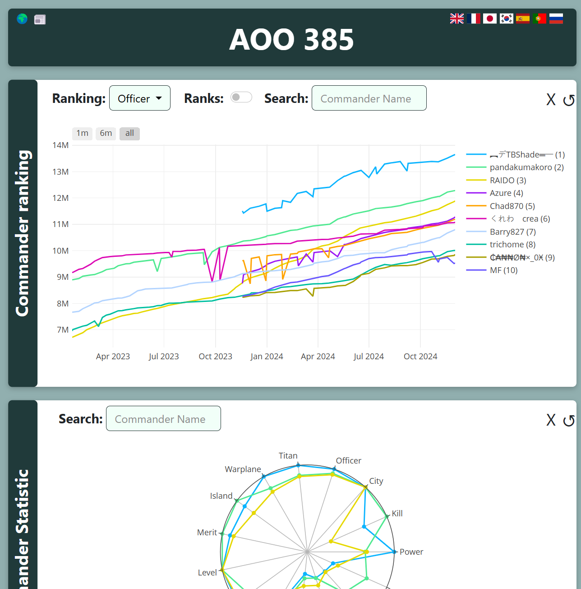

**Statistics for a void event** see this spreadsheet template [Google sheet](https://docs.google.com/spreadsheets/d/1H6R3VvAySgd1i9MLRDIwZ0MtF-9xS3SmJt_ClCrNLT8/edit?usp=sharing)

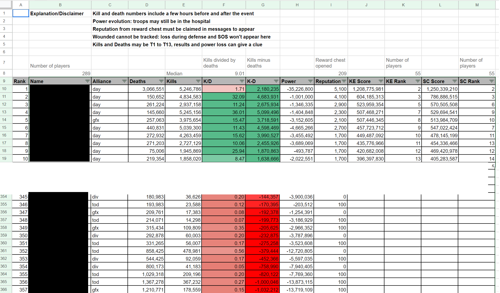

**Progress and activity reports** 

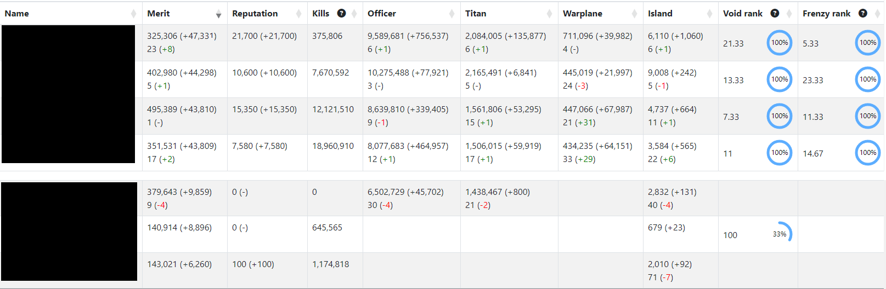

## Possible workflow

I personally did 3 data scans per months:
- one a few hours before the start of the void event
- one a few hours after the end of the void event, these two scans are used to compute void stats
- one a few hours after the end of the frenzy event, generate progress reports

## Main files

- `main.py`: GUI to run the bot, manage navigation through nation rankings
- `pocGUI.py`: GUI to process raw data extracted with the bot and insert them in a database
- `conf.json`: list of alliances used for pocGUI.py
- `data/emptyDB.sqlite`: empty database
- `insert_ranking_to_db.py`: Main function to insert raw data in the database, responsible to match cities in the database with cities in the raw data
- `nation_ranking_processing.py`: Process raw data from nation rankings and group them into cities
- `processAllianceMembersPage.py`: Bot section to extract city info frame from all players in a given alliance
- `processRankingPage.py`: Bot section to extract data from a nation ranking page
- `RectangleEditor.py`: very simple GUI to edit rectangles over a screenshot to help the bot navigate and identify image regions for the OCR (was mostly generated by ChatGPT, completely bugged but somehow does the job if you click on the right buttons in the right order)
- `report.py`: generate html activity and progression reports
- `utils.py`: utility functions
- `void_stats.py`: compute main statistics for a void event from the database
- `clean_db.py`: remove cities that have not been updated for a certain amount of time from the database
- `Log.py`: simple html logger for debugging purposes
- `aooutils/`: some better grouping of utility functions...
- `cmp/`: simple website to compare worlds from fast data scans
- `GUI/`: files for pocGUI.py
- `patterns/`: some image patterns for the bot to navigate
- `reports/`: html reports generated by `report.py`
- `xxx_tmp_nation_data.pickle`: temporary files to store raw data during data scans
- `xxxx_frame.pickle`: rectangle data for the bot to navigate
- `xxxx_cell.pickle`: rectangle data for the bot to navigate

## Installation

1. Install Python 3.10+ (tested on 3.10 and 3.11)
2. Install the required packages with `pip install -r requirements.txt`
3. Configure a BlueStacks emulator with the game AOO installed, make sure to set the same following options:

**Sidebar must be closed**

**Bluestack display settings:**

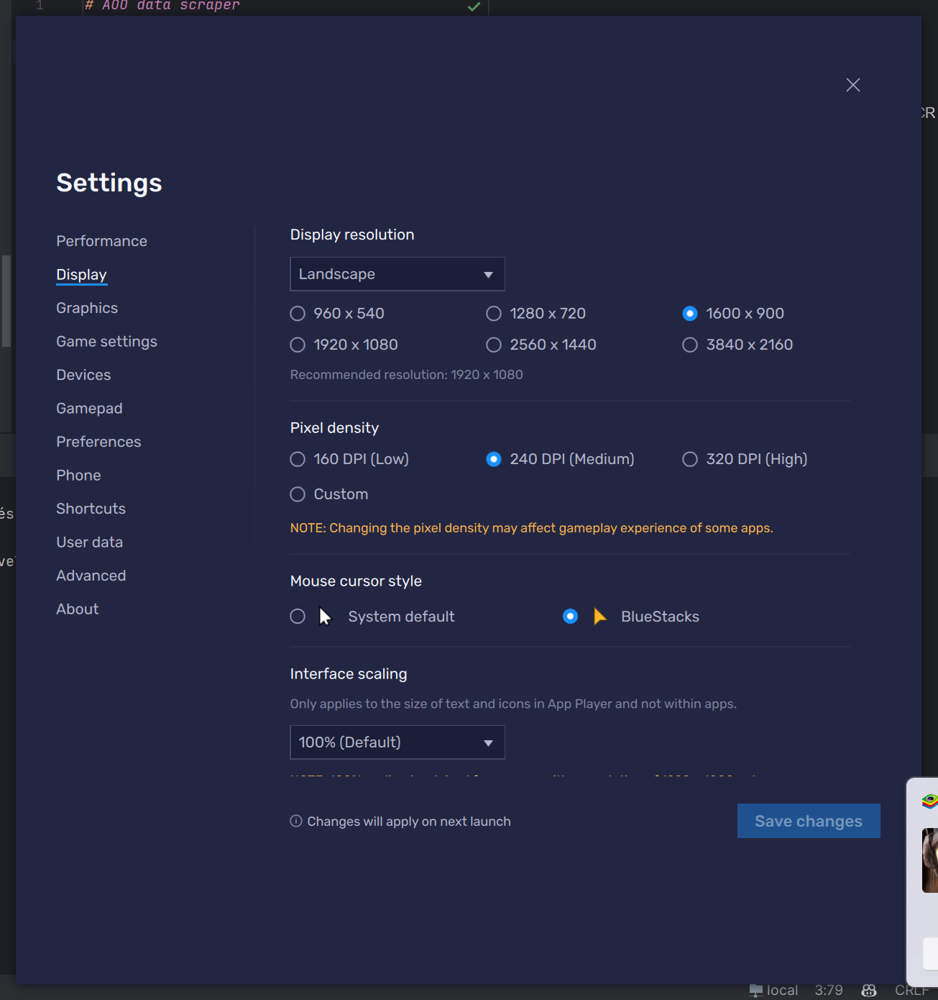

**Bluestack graphics settings:**

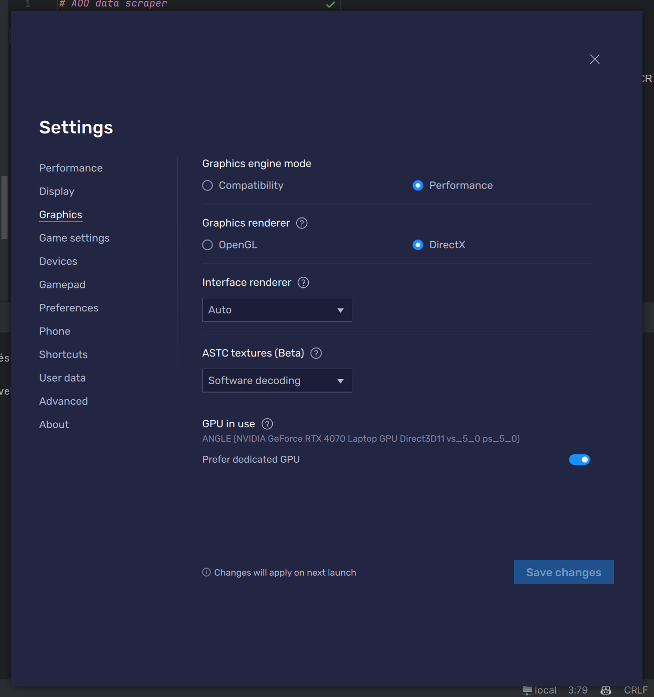

**Make sure that windows scaling is set to 100% in the display settings of Windows**

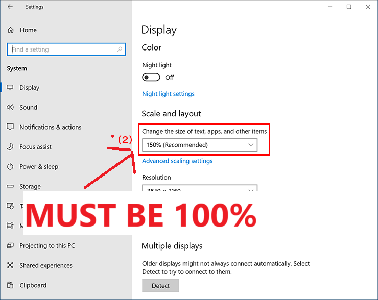

4. Make sure that the variable `bluestack_path` at the top of `main.py` points to the correct path of the BlueStacks executable

## Usage

### Data collection

1. Start the BlueStacks emulator, run AOO
2. Run `main.py`, it should resize the game window and put it in the top left corner of the screen

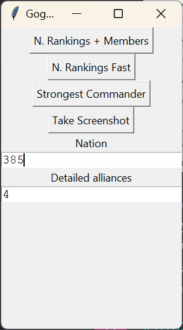

3. Enter the nation number in the input field
4. Enter the number of alliances for which you want to collect members data (will pick the top alliances in the alliance power ranking)
5. In the game navigate to the nation ranking page

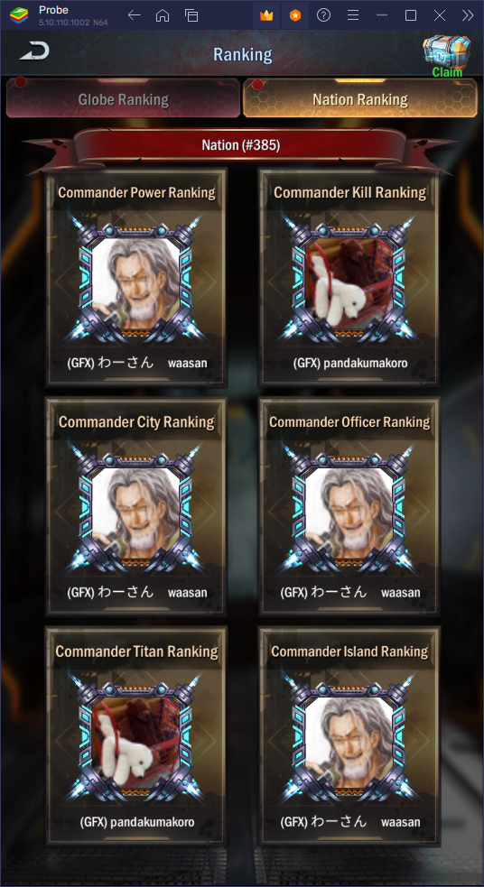

6. Click on "N. Rankings + Members" in the GUI, the bot will start collecting data. Don't touch the mouse or keyboard while the bot is running.
7. If the bot fails (error displayed in the console), restart the process from step 5, the bot will resume from where it stopped (or a bit before)
8. Let the bot run, depending on how many alliances you selected it can take between 20 and 40 minutes to collect all data

The Monday after the strongest commander event, you should also collect the event result.

9. Go to the event result page

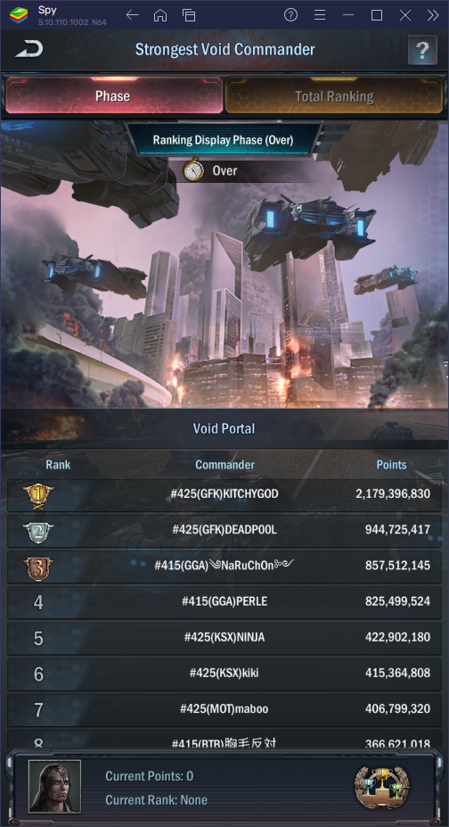

10. Click on "Strongest Commander" in the GUI, the bot will start collecting data

### Inserting data to DB

Inserting data to the database is a two-step process:

- First, the raw data is processed to group them by city, this is essentially based on image matching and OCR;
- Second, the processed data is inserted in the database, this is based on a dissimilarity function between city stats to match cities in the raw data with cities in the database.

At the end of each step the GUI allows you to check the results and correct mistakes. 

1. (Once) At the top of the file `pocGUI.py`, set the variable `websitepath` to the path where you have cloned the [website](https://github.com/aoodata/aoodata.github.io)
2. (Once) Copy the file `data/emptyDB.sqlite` to `$websitepath$/data/XXXDB.sqlite` where `XXX` is the world number
3. (Once) Edit the file `conf.json` and add the new world
4. Run `pocGUI.py`
5. Click on 'Insert new data to DB'

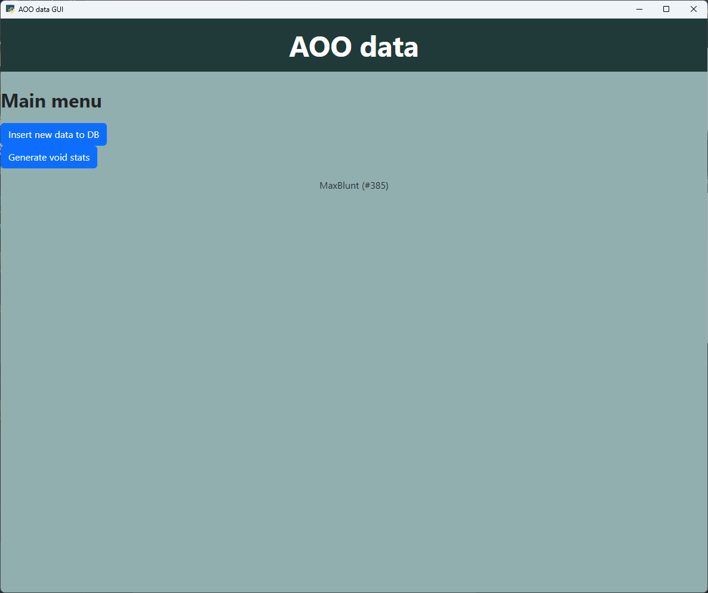

6. Select the world in the dropdown menu, the 'Ranking file' fields should be filled automatically with the latest ranking file, and click on 'Start insertion'

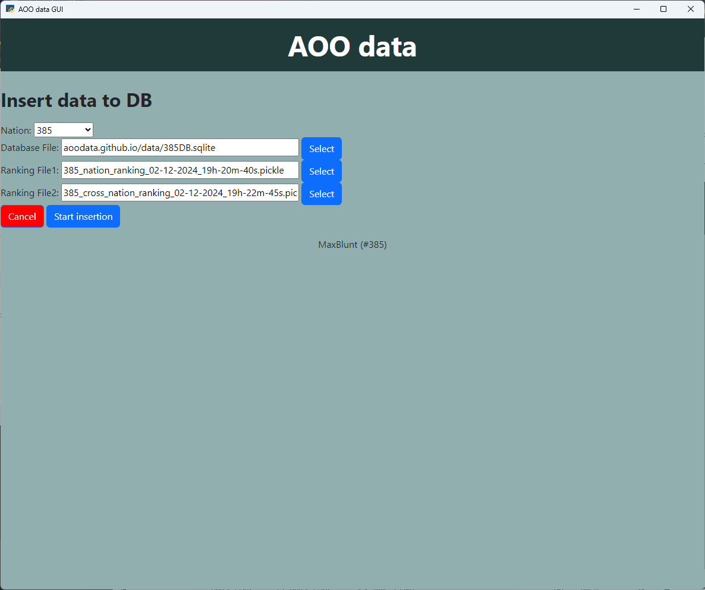

7. Wait while the data are processed (can take a few minutes depending on the amount of data and your computer)
8. The GUI will display the unsure matches. Entries display in red must be corrected: they concern players belonging to an alliance with detailed members data that have not been correctly matched.
   Look at the name and pictures on the left, pick on the right the matching city and click on merge (the gray one). 
   If you can't find the matching city in the right pane, click on 'Search commander' to search for a commander by its name.

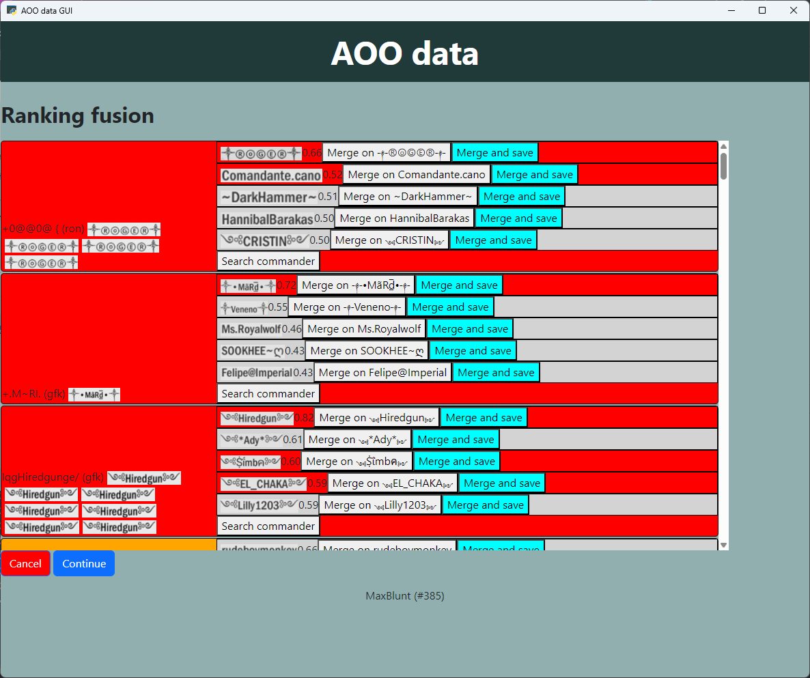

9. Entries in orange and yellow can generally be ignored (those are matches with a low similarity score)
10. Click on "Continue" and wait while the data are processed (may take a few minutes)
11. The GUI will now display matches between the cities in the collected data and the database. In the first section "Merged commanders", each entry represent a match. The title shows the commander name in the scan and the commander name in the database.
    The content show the scores in the scan and in the database. If a match is incorrect you can discard it by clicking on "Remove"

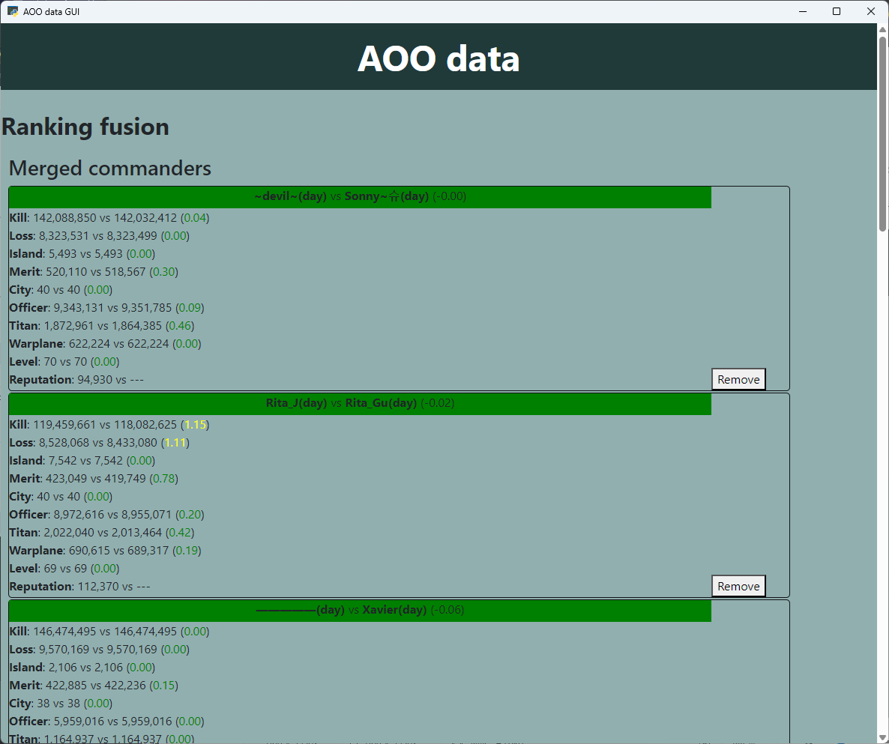

12. The second section "Commanders to insert" shows the commanders that have not been matched with any commander in the database. 
    If similar (but not sufficiently close) commanders could be found in the database, they are displayed, and you can choose to merge the commander with one of them by clicking on "Merge".
    You can also search for a commander name in the database by clicking on "Search commander" and merge the commander with the found commander.

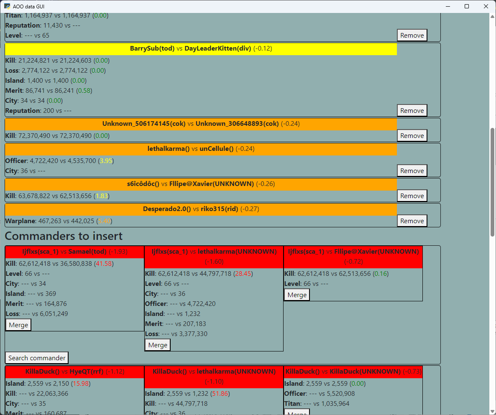

13. Click on "Continue", you are now on the verification final step. You can display the result in the website by clicking on "Verify". 
    If you are satisfied with the result, click on "Finalize" to insert the data in the database.

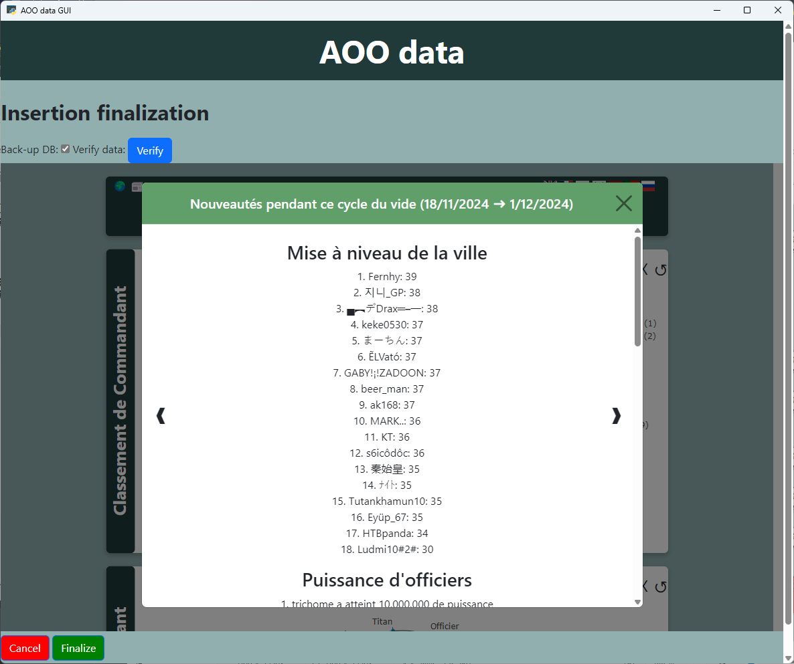

Note that as long as you don't click on "Finalize", everything is done in a temporary database and no data is inserted in the final database.
Also, as long as PocGUI is running, a local web server is started to display the website. You can access it by going to `http://127.0.0.1:8000/` in your browser.

### Generating void reports

1. Run `pocGUI.py` after inserting latest data in the database.
2. Click on 'Generate void stats'

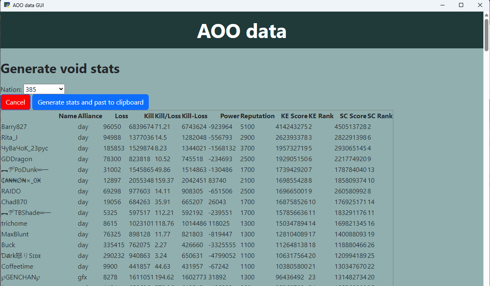

3. Select the world in the dropdown menu and click on 'Generate stats and copy to clipboard'. You can now past the computed and formated data directly in the template spreadsheet template [Google sheet](https://docs.google.com/spreadsheets/d/1H6R3VvAySgd1i9MLRDIwZ0MtF-9xS3SmJt_ClCrNLT8/edit?usp=sharing).

### Generating progress reports

1. At the top of the file `report.py`, set the variables:

   - `database_base_path`: path to where databases are stored
   - `world`: world number as a string
   - `alliances`: list of alliances to include in the reports 
   - `report_path`: path to where reports will be stored
   - `duration_days`: number of days to consider for the report
   
2. Run `report.py`
